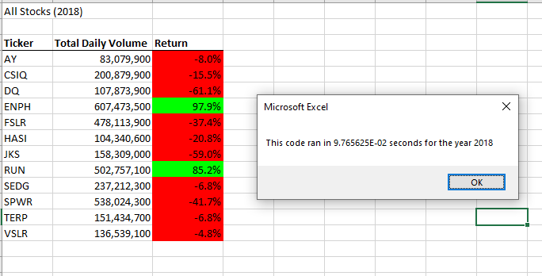

# Stock Analysis

## Overview of Project

### Purpose
The purpose of this project is to use VBA to analyze a dataset in order to determine which stocks would be best to invest in.
In addition, the the VBA analysis script will be refactored so that the VBA script can run faster, which will allow for effective analysis for larger datasets. 

## Results
In the analysis, two table were created. These table displayed the Total Daily Volume and the Return for each stock. There was one table for each year: 2017 and 2018. 
In 2017, nearly all stocks did well, receiving a positive return percentage, ranging from 8% all the way up to nearly 200%. In contrast, nearly every stock in 2018 had a negative return percentage, except for two. These results can be viewed in the images below.

Before refactoring, it took approximately 0.8086s for the VBA script to run for both the 2017 and 2018 datasets. After refactoring, the run time dropped significantly lower, at approximately 0.09766 seconds for both the 2017 and 2018 datasets (shown above). Thats over 8 times faster! 

## Summary
Refactoring has its advantages, such as efficiency and improved speed of the script. Some disadvantages, however, is that it can become time consuming to go through and change all the code. Additionally, it's possible to make errors while refactoring the code, thus ruining a functional code. 
Applying these advantages and disadvantages of refactoring to the original VBA script, it seems that it wouldn't be worth the disadvantages of refactoring if it is not needed to create the advantage of a faster running script. For example, a small dataset, such as the one we have been working with, wouldn't really benefit from a faster, more efficient script, since the average human would'nt be able to tell the difference. A much larger dataset, however, may take a large amount of time to run, thus it would be beneficial to refactor the code. 